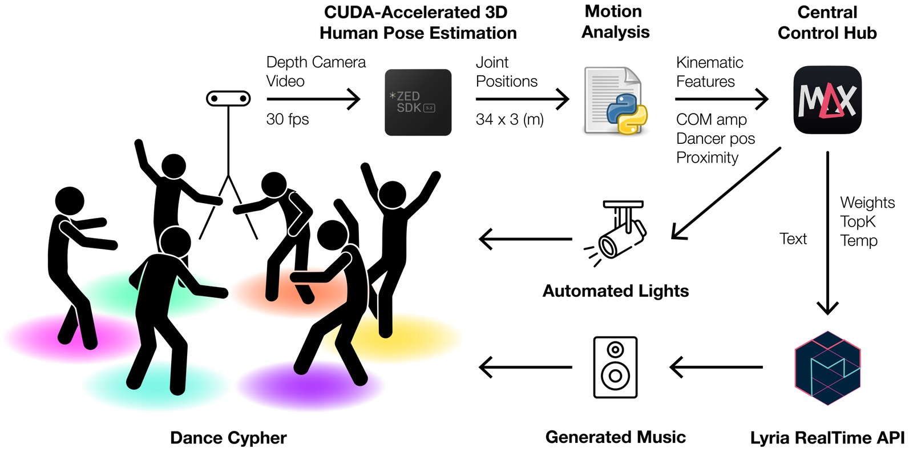
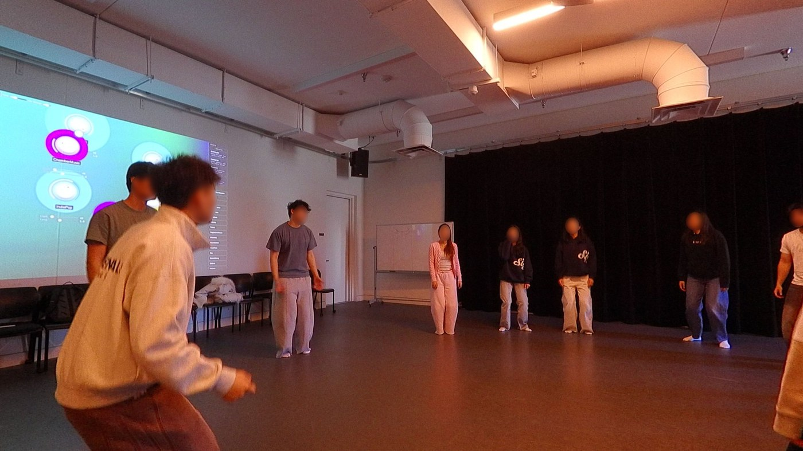
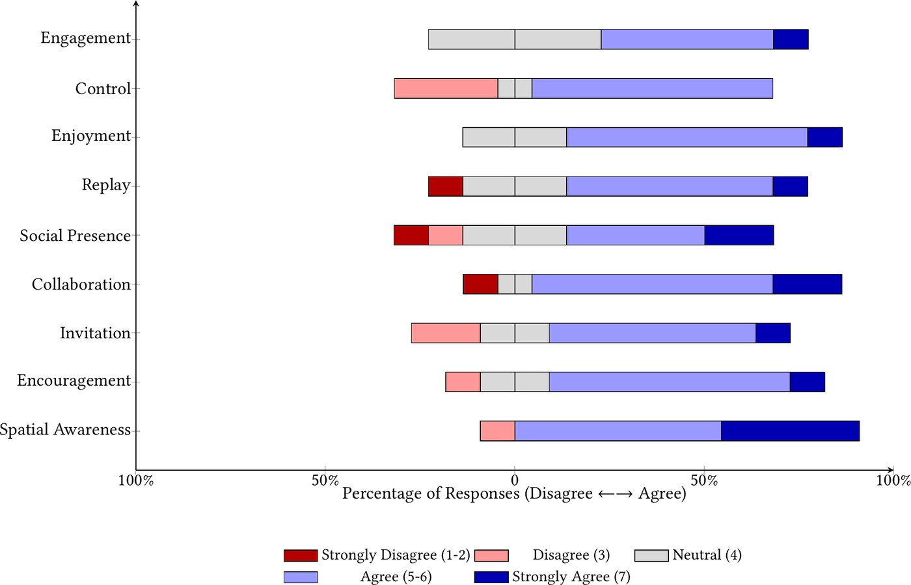
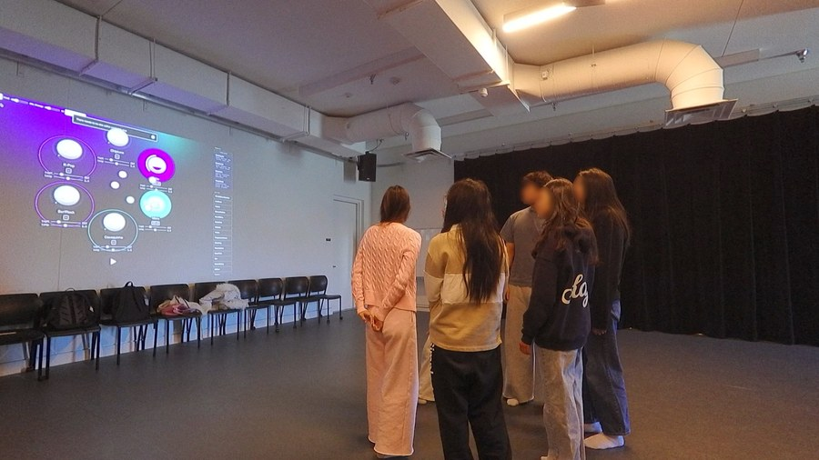
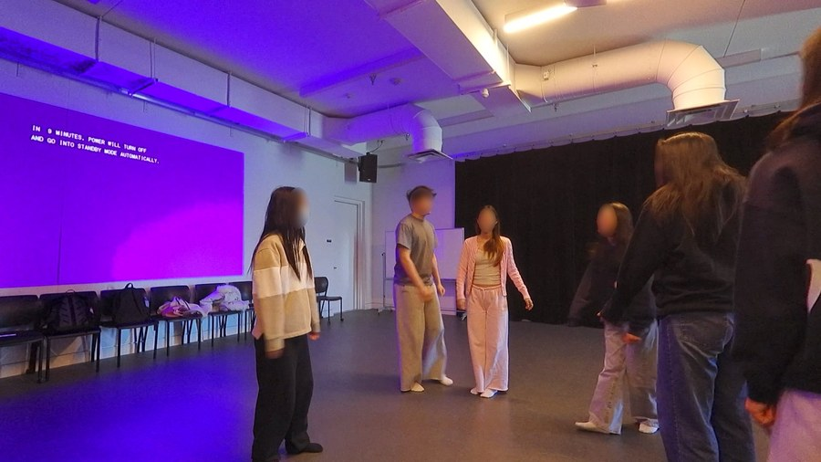
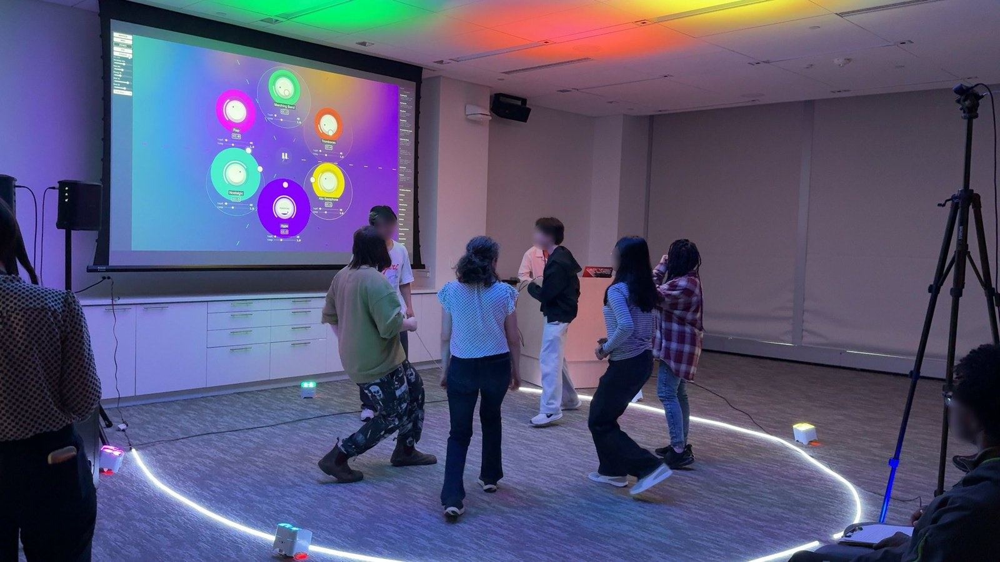

  
Translating collective movement into prompts for a real-time music model

  
Zhixing Chen1, Cheng-Zhi Anna Huang1

  
1 MIT &middot; Correspondence: <a href="mailto:zhixingc@mit.edu">zhixingc@mit.edu</a>

  <ul class="post-links">
    <li><a href="https://arxiv.org/abs/2609.18062">Paper (arXiv)</a></li>
    <li><a href="https://encypher-chi.github.io/">Project page</a></li>
    <li><a href="https://nime.org/proceedings/2026/nime2026_7.pdf">Con Moto (NIME 2026)</a></li>
  </ul>
  <ul class="post-sections">
    <li><a href="#how-it-works">How it works</a></li>
    <li><a href="#co-design">Co-design</a></li>
    <li><a href="#study">The user study</a></li>
    <li><a href="#museum">The museum event</a></li>
    <li><a href="#the-performance">The performance</a></li>
    <li><a href="#next">What we take forward</a></li>
    <li><a href="#cite">How to cite</a></li>
  </ul>

In Hip-Hop culture, a cypher is a circular freestyle practice defined by energy sharing, exchange, and communal response. Encypher is a collaborative generative music system that translates collective movement qualities into text prompts to condition real-time music generation for dance cyphers. The name plays on *encipher*, reflecting the system's role in translating embodied movement into a generative musical process.

Most HCI work in human-AI co-creation centers the solo performer. As generative music matures, we ask not only what AI can compose but what social encounters it can organize around sound. This post is the shorter account of how the system got built: five weeks of co-design with local dancers, a user study with participants who had never met, a public museum event, and a live performance.

<h2 id="how-it-works">How it works</h2>

Upper Body Center of Mass Amplitude (COMAmp) is our primary movement feature, reflecting how much participants are "grooving," a low-energy rocking or swaying motion that does not require stepping or arm gestures. Focusing on groove enables broader participation across different Hip-Hop styles and skill levels. A depth camera watches the whole circle at once, and COMAmp measures how much each participant's upper-body center of mass oscillates over a rolling two-second window.

Each dancer's COMAmp is then mapped to the weight of a prompt representing their assigned musical element, and these weights sum across all participants, creating a collective steering signal where the aggregate energy of the group shapes the generation in real time. The prompts steer <a href="https://deepmind.google/models/lyria/realtime/">Lyria RealTime</a>, which generates audio continuously.

<figure>
  

  <figcaption>Encypher uses a depth camera to capture the joint movements of dancers in a cypher. Motion analysis extracts kinematic features such as center-of-mass amplitude, dancer position and proximity, then sends them to Max/MSP, which serves as the control hub for music generation and lighting.</figcaption>
</figure>

<h2 id="co-design">Designing with versus designing for a community</h2>

The system came out of weekly sessions with a local breaking crew during their Monday open training sessions, in the corner of the room they already practice in. Con Moto's limb-velocity mappings, designed for a duet performance over classical piano and jazz models, did not survive co-design with breakers and were replaced by COMAmp, capturing movement that does not require stepping or arm gestures. The insight, that interaction models must be calibrated to specific movement vocabularies, directly shaped the design.

**Addressing latency through co-designed affordances.** Lyria RealTime's two-second generation latency fundamentally challenged the sense of causal coupling dancers expected. Rather than treating this as a technical failure, we co-designed a "charging" mechanic: dancers build energy on their zone, and once it reaches a threshold, the music responds. This transformed a constraint into an affordance, and the delay became intentional, teaching users that collective presence precedes musical response.

The crew's feedback improved the system, catching bugs and suggesting interaction improvements, but it could not answer the core research question: how can generative music support social interaction among people who do not know each other? Established communities already possess strong social dynamics, and the system became a novelty add-on rather than a social bridge. That realization changed the study design, since designing *with* an established community and designing *for* social connection among strangers are fundamentally different challenges.

<h2 id="study">The user study</h2>

Eleven participants from an introductory movement class, none of whom knew each other, danced in three rounds, each with the visualization screen and then without it. The session began with a collective warmup that was part of the class's normal routine, letting participants acclimate to the movement vocabulary of grooving and to one another.

<figure>
  

  <figcaption>The session opened with a collective warmup activity that was part of the class's normal routine.</figcaption>
</figure>

A key design goal was to shift the felt locus of agency from the individual performer to the group, and participants described that shared agency directly, perceiving the music as responding to the room rather than as a one-to-one trigger of their own movement.

> "It felt like the music was responding to the group. When the energy was good, it felt like the music was better." (P1)

> "The guy across from me rocked invitingly and I tried to match his movements and energy." (P5)

Spatial awareness was the strongest item at 90.9% agreement and collaboration followed at 81.8%. Engagement and enjoyment were more mixed, at 54.5% and 72.7%, with the rest neutral. These numbers should be read cautiously: the study ran in a credit-bearing classroom where the first author was a guest instructor, and the novelty effect of interacting with high-fidelity neural audio for the first time likely skewed engagement and enjoyment upward.

<figure>
  

  <figcaption>Diverging stacked bar chart showing participants' (n=11) reported experience of the Encypher system across dimensions of social interaction and personal experience.</figcaption>
</figure>

<figure>
  

    

    

  

  <figcaption>The same group with the visualization screen on (left) and removed (right). The visualization gave participants a shared object of attention that lowered the social barrier, but for some this came at the cost of direct interpersonal awareness.</figcaption>
</figure>

These observations suggested a design direction for the next iteration: replacing or augmenting the screen with projected light onto the dancers themselves.

<h2 id="museum">The museum event</h2>

To test the system beyond a classroom and with members of the broader public, we deployed it as part of *We the Beat*, a 65-minute session within *Design Redefined*, a public co-design event hosted at the MIT Museum. Around 25 participants rotated through the circle in groups of five to six. We complemented the projection screen with colored lights on the ceiling, driven by the same OSC signals, and participants located their zones without attending to the screen.

<figure>
  

  <figcaption>Strangers dancing with Encypher at the museum event. Faces are blurred throughout this post.</figcaption>
</figure>

<h2 id="the-performance">The performance</h2>

In May we performed a version with no screen at all, at the MIT Music Technology Research Showcase in Thomas Tull Concert Hall, in front of an audience of about 300. The six zones were each pre-assigned a musical element, Afrohouse, djembe, Hip-Hop, an 808 drum machine, classical piano and dance jazz, matched where possible to the performing dancers' own interests and training. Each zone was lit from above by a colored stage light, and the Max/MSP hub sent each dancer's COMAmp energy over OSC to the venue's lighting console, which mapped it to the intensity of that dancer's light. Dancers entered one at a time, so the elements layered in as the circle filled.

<figure>
  

    

      <iframe
        src="https://www.youtube-nocookie.com/embed/0CEnWNZRi9I"
        title="Encypher: live performance at the MIT Music Technology Research Showcase"
        allow="accelerometer; autoplay; clipboard-write; encrypted-media; gyroscope; picture-in-picture; web-share"
        referrerpolicy="strict-origin-when-cross-origin"
        allowfullscreen
        loading="lazy"></iframe>
    

  

  <figcaption>The performance in Thomas Tull Concert Hall. A dancer charging their zone brightens the pool of light they stand in. Edited excerpt, blurred throughout for the dancers' privacy. The <a href="https://encypher-chi.github.io/">project page</a> has the same video with notes tied to each section of the paper.</figcaption>
</figure>

Without a screen there was no shared object to watch. Dancers oriented toward one another and toward the light at their feet, and the mutual attention that the screen had partly displaced during the user study was visibly restored. The pools of colored light also made each dancer's contribution legible to the audience in a way the screen never could, since energy showed up on the body itself.

<h2 id="next">What we take forward</h2>

In the live performance the venue itself became part of the feedback loop: dancers moved, the camera sensed, the music and the stage lights responded, and the dancers moved differently in turn. Nothing in that loop was specific to six zones or to one model. A stage instrumented with sensors, whose lighting, sound and generative systems each act on shared movement data, generalizes the idea from a single installation to a design pattern for performance spaces.

The study was eleven participants in a single session, evaluated through self-report and the first author's observations. The screen and no-screen conditions were not counterbalanced, since removing the screen coincided with group order and with the introduction of floor tape, so the shift we attribute to the screen cannot be cleanly separated from those factors. We also set aside a comparison against a pre-selected playlist and a live DJ, because comparing a first prototype with a long-standing practice would have been premature. With the system now stable, that comparison is the appropriate next study, and until it is run the shared agency participants reported cannot be attributed to generative music specifically rather than to shared music in a cypher.

<h2 id="cite">How to cite</h2>

If you use this work, please cite the preprint.

<pre><code>@article{chen2026encypher,
  title         = {Encypher: Shared Agency and Social Presence in Collaborative Music Generation for Dance Cyphers},
  author        = {Chen, Zhixing and Huang, Cheng-Zhi Anna},
  journal       = {arXiv preprint arXiv:2609.18062},
  year          = {2026},
  archivePrefix = {arXiv},
  eprint        = {2609.18062},
  primaryClass  = {cs.HC},
  url           = {https://arxiv.org/abs/2609.18062}
}</code></pre>

Thanks to the members of MIT Imobilare and moveMENtality for their collaboration during weekly co-design sessions and for their insightful feedback, to Grisha Coleman for hosting a study in her classroom, to the MIT Museum, Morningside Academy for Design and Innovators for Purpose for organizing Design Redefined, to Eran Egozy and the MIT Music and Theater Arts faculty for the showcase, to Perry Naseck for the lighting, to Alex Tung and Mark Rau for the sound, to Kimberly Y. Zhang for her help during the study and the museum event, and to the dancers who performed.
